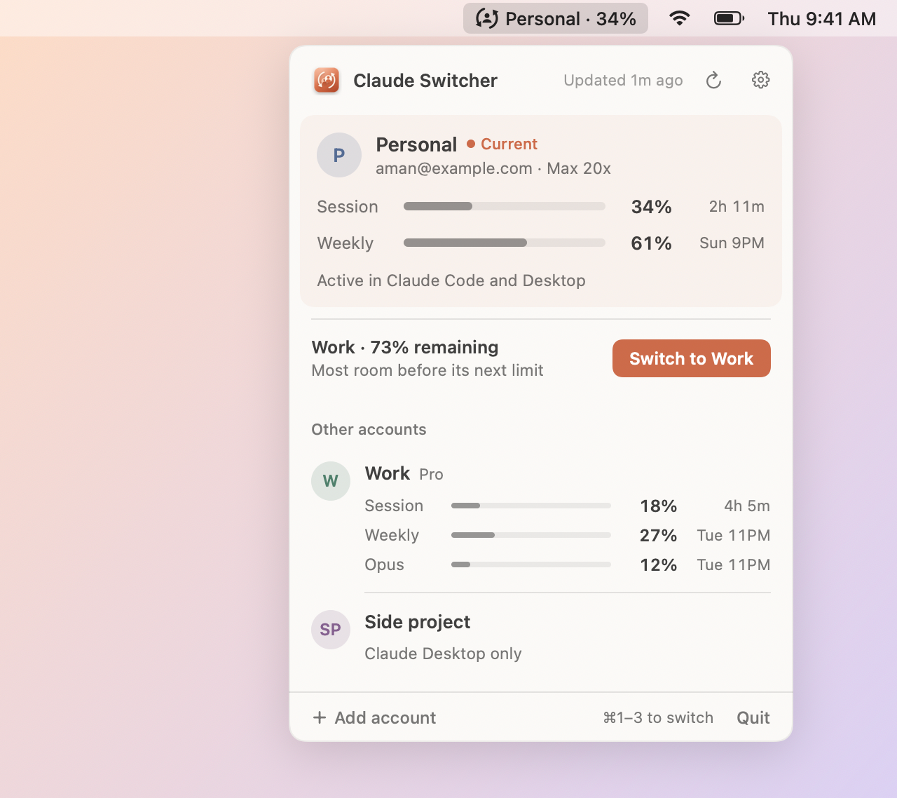

<div align="center">


# Claude Switcher

**Switch between Claude accounts from your Mac's menu bar — and see how much of each one's usage you have left.**


<picture>
  <source media="(prefers-color-scheme: dark)" srcset="docs/screenshot-dark.png">
  
</picture>

</div>

## Features

- **One click switches everywhere.** Clicking an account switches the Claude Code CLI right away,
  then switches the Claude Desktop app (and its Code tab) to the same account.
- **Usage limits for every account.** Shows session (5-hour) and weekly limits, plus Opus and
  Sonnet weekly limits on plans that have them, with reset times. Bars stay grey until a limit
  gets close, then turn amber and red.
- **Switch suggestion.** When another account has noticeably more room left, a
  **Switch to …** button appears. "Room" means whichever of that account's limits is closer to
  running out.
- **Pace in tooltips.** Hover a bar to see when it resets and whether you're using it faster or
  slower than time is passing.
- **Keyboard shortcuts.** ⌘1–⌘9 switch accounts while the popover is open.
- **Usage in the menu bar.** The menu bar shows the active account and its session usage, for
  example `Personal · 34%`.
- **No extra sign-in.** Desktop logins are matched to CLI logins automatically by account ID.
- **Logins stay in the keychain.** Saved logins are kept in your macOS keychain, never in plain
  files. MCP connector logins and other Claude Code settings aren't changed by a switch.
- **Small and native.** It's a single native app, about 1 MB, with no dependencies, and it
  starts at login.

## Install

### Download

Get the latest `Claude-Switcher-vX.Y.Z.zip` from
[Releases](https://github.com/amanv8060/cc-switcher/releases), unzip it, and move
**Claude Switcher.app** to `~/Applications` or `/Applications`.

The app isn't notarized yet, so macOS will block it the first time you open it. Right-click the
app and choose **Open**, or run:

```bash
xattr -dr com.apple.quarantine "/Applications/Claude Switcher.app"
```

### Build from source

Requires macOS 13 or later and the Xcode command line tools.

```bash
git clone git@github.com:amanv8060/cc-switcher.git
cd cc-switcher
./build.sh --install
```

This builds the app, copies it to `~/Applications/Claude Switcher.app`, turns on launch at login
and opens it. Run `./build.sh` on its own to build into `./build` without installing.

## Using it

| To… | Do this |
| --- | --- |
| Add an account | **Add account** → sign in with `claude auth login` in the Terminal window that opens. |
| Switch | Click an account, press ⌘1–⌘9, or use the **Switch to …** suggestion. |
| Set up Claude Desktop for an account | Switch to it once. If it has never signed in to Desktop, you'll be offered to set it up. |
| Rename or remove | Right-click an account. |
| Settings | Click the gear icon (menu bar text, confirmations, launch at login). |

> [!IMPORTANT]
> Don't use `claude auth logout` to change accounts. Logging out can revoke the saved login.
> Use **Add account** instead.

The current account shows where it's active, for example *Active in Claude Code and Desktop*.
If Claude Desktop is on a different account, click **Use in Desktop too** to bring it in line.

## How it works

<details>
<summary><b>Claude Code CLI</b></summary>

Claude Code keeps its login in the keychain item `Claude Code-credentials` and its account info
in `~/.claude.json` (`oauthAccount`). A switch replaces only the `claudeAiOauth` login and
`oauthAccount`. Everything else stays as it is, including MCP logins and settings.

Claude Code issues a new refresh token each time it refreshes a login, so the switcher re-saves
the current login before every switch and whenever the popover opens. `~/.claude.json` is backed
up to `~/.claude.json.switcher-backup` before each write. Claude Code sessions that are already
running keep the old account until you restart them.
</details>

<details>
<summary><b>Claude Desktop</b></summary>

Each account keeps its own copy of `~/Library/Application Support/Claude`. A switch quits Claude,
renames the folders (which is instant) and reopens Claude. The Desktop Code tab uses the Desktop
app's login, so it switches along with the app. Accounts are paired using `lastKnownAccountUuid`
in Claude's `config.json`.

Switching Desktop accounts stops any chats or Code sessions running in Claude Desktop. Each
account's data folder uses its own disk space.
</details>

<details>
<summary><b>Usage limits</b></summary>

Usage comes from `api.anthropic.com/api/oauth/usage`, the same endpoint as Claude Code's `/usage`
command. It refreshes every 5 minutes. If a saved login has expired, the app refreshes it and
saves the new login.
</details>

## Development

```
Sources/
├── main.swift           entry point + CLI flags
├── AppDelegate.swift    status item, popover, settings menu, menu bar icon
├── AppModel.swift       state + actions shared by the UI
├── Views.swift          SwiftUI popover
├── ClaudeCode.swift     CLI login switching
├── ClaudeDesktop.swift  Desktop profile switching
├── UsageAPI.swift       usage + token refresh
├── Keychain.swift       /usr/bin/security wrapper
├── AppState.swift       saved account list
└── Constants.swift      paths
scripts/make-icon.swift  draws the app icon
```

See [CONTRIBUTING.md](CONTRIBUTING.md) for guidelines and [SECURITY.md](SECURITY.md) for what
the app does with your data.

Useful flags (run the binary inside the app):

```bash
APP="build/Claude Switcher.app/Contents/MacOS/ClaudeSwitcher"
"$APP" --selftest --usage      # print the detected account and its usage
"$APP" --render-preview docs   # regenerate the README screenshots with sample data
"$APP" --login-item on|off     # turn launch at login on or off
```

To redraw the icon, delete `Resources/AppIcon.icns` and run `./build.sh`.

---

<sub>MIT licensed · Not affiliated with or endorsed by Anthropic. This app relies on undocumented parts of Claude Code and Claude Desktop that may change.</sub>
